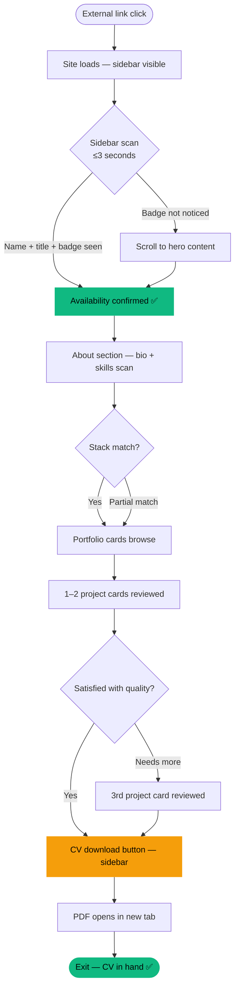
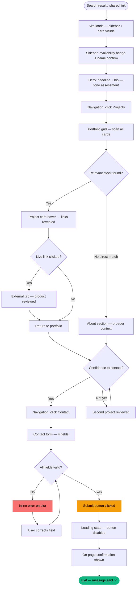
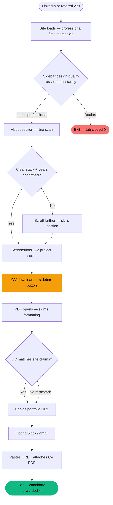

# UX Design Specification bmad-1

**Author:** Agun Gunawan
**Date:** 2026-02-25

---

## Executive Summary

### Project Vision

A conversion-optimized personal portfolio website for Agun Gunawan — Senior
Frontend Developer with 8+ years of experience. The site functions as a
fully-owned professional channel designed to move visitors from discovery to
contact with minimal friction. Every design decision serves two primary conversion
actions: CV download and contact form submission.

### Target Users

**Sarah — The Tech Recruiter:** Desktop-primary, time-pressured, scanning 10–20
profiles per day. Needs skills, experience level, and availability confirmed within
3 seconds. CV download is her primary action. Values clarity over creativity.

**Budi — The Startup CTO:** High-intent, often mobile or late-night desktop. Goes
straight to portfolio to assess technical quality and stack fit. Availability badge
is the trust signal that bridges evaluation to contact. Values proof over polish.

**Diana — The HR Manager:** Evaluation mode, preparing a shortlist. Downloads CV,
verifies professional impression, then forwards the URL internally. The site itself
functions as a credibility artifact she hands to decision-makers.

### Key Design Challenges

1. **3-Second Credibility:** Hero section must communicate seniority, specialization
   (React + Webflow), and availability before the first scroll — without relying on
   walls of text or vague taglines.

2. **Dual-Stack Coherence:** React JS + Webflow is the core differentiator but risks
   reading as unfocused. Portfolio structure and project card framing must make this
   pairing feel intentional and powerful.

3. **Friction-Free Conversion:** CV download and contact form must be discoverable
   without hunting and reachable from anywhere on the page. Contact form must feel
   low-stakes and fast — not like a formal job application.

4. **Content Resilience:** The layout must gracefully handle real-world content
   variation (different image sizes, description lengths) without aesthetic breakage,
   given that content is being created in parallel with development.

### Design Opportunities

1. **Availability-First Trust Signal:** A live, prominent "Open to Work" badge is
   uncommon and powerful — it signals confidence and removes recruiter hesitation
   immediately. The placement and visual weight of this badge is a key design lever.

2. **Problem-Led Project Cards:** Moving beyond thumbnail + stack to include a
   one-line problem statement per project card elevates the portfolio from gallery to
   narrative — giving technical evaluators the context they need without full case
   study pages.

3. **The Trusted Leave-Behind:** Since Diana forwards the URL rather than submitting
   the form, the site URL + OG preview image must function as a standalone trust
   artifact. A strong OG image (name, title, professional photo) carries outsized
   weight in Slack and LinkedIn previews.

---

## Core User Experience

### Defining Experience

The site's core experience is a single high-stakes first impression: a visitor
decides within the first scroll whether Agun is worth their time. Every design
decision either supports or undermines that moment. The portfolio does not have
a returning-user loop — it has one conversion window per visitor, which must
culminate in either a CV download or a contact form submission.

### Platform Strategy

**Primary:** Desktop browser — recruiters and HR managers working in tabs,
CTOs doing late-night due diligence. Mouse/keyboard navigation, generous
viewport for information density.

**Secondary:** Mobile browser — high-intent technical visitors (Budi archetype)
checking a shared link. Touch targets must be generous, hero content must be
above the fold on mobile, and the contact form must be thumb-friendly.

**Architecture:** Single-page scrolling with anchor navigation. Static site
(Next.js SSG or Webflow). No offline requirements. No authentication.

### Effortless Interactions

- **CV download:** Button visible in the hero section without scrolling on all
  devices. One click → PDF opens. No interstitial, no confirmation step.
- **Portfolio scanning:** Each project card fully readable in under 10 seconds —
  title, one-line problem statement, tech stack, and action link all visible at a glance.
- **Contact form submission:** 4 fields only (name, email, subject, message),
  submit button clearly labeled, on-page confirmation immediately visible after send.
- **URL sharing:** OG image does the trust work automatically — professional
  photo, name, and title render in Slack/LinkedIn previews without any user effort.

### Critical Success Moments

1. **The exhale moment:** Visitor lands and reads "Senior Frontend Developer —
   8+ years — Open to Work" before their first scroll. Validation is instant.
2. **The stack recognition moment:** Visitor sees a project card using their
   exact required tech stack. Evaluation converts to intent.
3. **The CV forward moment:** Diana downloads the PDF and it's formatted, current,
   and credible enough to attach to an internal Slack message.
4. **The sent confirmation moment:** Budi submits the contact form and sees a
   clear confirmation. He closes the tab with confidence the message arrived.

### Experience Principles

1. **Clarity before creativity** — the visitor should never wonder where to look
   or what to do next. Visual hierarchy leads; decoration follows.
2. **Trust is earned in layers** — availability → experience depth → portfolio
   quality → contact invitation. The page rewards progressive engagement.
3. **Every primary CTA is always visible** — CV download and contact access must
   never require scrolling to discover.
4. **The page works for people who don't read** — availability badge, skill tags,
   project thumbnails, and section headings carry the full story for scanners.
5. **Speed is a non-negotiable trust signal** — for a frontend developer's portfolio,
   a slow or janky site is a disqualifying red flag. Performance is UX.

---

## Desired Emotional Response

### Primary Emotional Goals

**Relief** — the dominant emotion on arrival. Visitors have seen too many
outdated, generic, or effort-requiring portfolios. This site should feel like
a breath of fresh air: immediately clear, immediately credible, immediately
current. "Finally, someone who has their act together."

**Confidence to act** — the emotional state just before the primary conversion
actions (CV download, contact form). Not excitement or delight — simply the
quiet certainty that reaching out is a safe, worthwhile move.

### Emotional Journey Mapping

| Stage               | Visitor State on Arrival    | Target Emotional State After                |
| ------------------- | --------------------------- | ------------------------------------------- |
| Hero / first scroll | Skeptical, time-pressured   | Relief — credibility confirmed instantly    |
| About section       | Evaluating seniority        | Trust — depth and personality come through  |
| Portfolio section   | Assessing quality/fit       | Recognition — "this person gets my domain"  |
| CV download         | Needs something to forward  | Safety — professional artifact in hand      |
| Contact form        | Hesitant to commit          | Calm confidence — low-stakes, clear process |
| Post-submission     | Uncertain if message landed | Closure — confirmation removes all doubt    |

### Micro-Emotions

**Want to cultivate:**

- **Confidence** over confusion at every step
- **Trust** over skepticism from the first scroll
- **Recognition** over generic admiration in the portfolio
- **Calm** over anxiety entering the contact form
- **Closure** over uncertainty after submission

**Must actively prevent:**

- **Doubt** about whether the site is current ("is this still accurate?")
- **Hesitation** at the contact form ("is this too formal? will he see this?")
- **Friction** at the CV download ("where is the CV button again?")
- **Abandonment anxiety** after form submission ("did that actually send?")

### Design Implications

- **Relief → Hero design:** Availability badge, years of experience, and clear
  title must be visible above the fold with no ambiguity. No mystery opens,
  no "click to reveal who I am" mechanics.
- **Recognition → Project cards:** Each card must include enough context (stack,
  one-line problem) that a technical visitor can pattern-match to their own
  situation within a 10-second scan.
- **Safety → CV download:** The download button must be consistently labeled,
  prominently placed, and the PDF must open immediately. No interstitial, no
  redirect chain — just the file.
- **Calm confidence → Contact form:** Form must look short (even if it has 4
  fields), labels must be friendly not corporate, CTA copy should feel
  conversational ("Send a message" > "Submit inquiry").
- **Closure → Post-submit state:** On-page confirmation must be visible,
  warm, and unambiguous. Not just "Form submitted" — "Thanks, I'll be in touch."

### Emotional Design Principles

1. **Absence of doubt is worth more than delight** — this isn't an entertainment
   product. Remove friction and uncertainty before adding personality flourishes.
2. **Credibility feels calm, not loud** — trust is built through quiet consistency:
   clean typography, current content, working links, fast load. Not animations.
3. **Every uncertainty is a conversion killer** — if a visitor has to wonder about
   anything (Is he available? Did my message send? Is this CV current?), design
   has failed. Answer every implicit question before it forms.
4. **Warmth earns permission** — the human-first tone in copy creates emotional
   permission to reach out. A site that feels robotic makes contact feel awkward.

---

## UX Pattern Analysis & Inspiration

### Inspiring Products Analysis

**Dark premium with elegant typography:**
A dark-mode-first aesthetic (deep navy, charcoal, or near-black base) with a
carefully chosen type scale. Typography carries hierarchy and premium feel —
large, confident heading sizes with purposeful weight contrast. Reference
aesthetic: Stripe, Linear, Vercel landing pages, and portfolios like
Brittany Chiang's (dark teal theme with monospaced accents).

**Simple but panoramic — easy on the eyes:**
Strong section-by-section information architecture where each section answers
exactly one question. Low cognitive load through restraint: generous whitespace,
clear labels, single focal point per viewport. "Easy on the eyes" in a dark
theme means softened text contrast (slate on dark, not harsh white-on-black)
and no competing visual elements within a section.

**Colorful:**
Color used as signal, not decoration. Dark base + vivid accent color(s) creates
premium punch without visual chaos. Accent applied selectively to: availability
badge, CTA button highlights, skill tag chips, hover states, and section
micro-accents. Color density is low but high-impact — makes the dark palette
feel alive and intentional.

### Transferable UX Patterns

| Pattern                               | Inspired By                            | Application for Agun                           |
| ------------------------------------- | -------------------------------------- | ---------------------------------------------- |
| Dark canvas + vivid accent color      | Stripe, Brittany Chiang portfolio      | Premium feel; accent draws eye to primary CTAs |
| Large fluid type scale                | Linear, Vercel                         | Hierarchy without icons; elegant scanning      |
| Full-width section layout             | Notion marketing site                  | Gives "big picture" instantly per section      |
| Skill tag chips with accent color     | GitHub README conventions              | Scannable stack identity, no text walls        |
| Softened text contrast on dark        | Tailwind UI dark components            | Comfortable reading, reduces eye strain        |
| Accent-colored availability badge     | Status indicators (Statuspage, Linear) | Immediate, unambiguous availability signal     |
| Monospaced font accent for code/stack | Developer portfolio convention         | Signals technical credibility authentically    |

### Anti-Patterns to Avoid

| Anti-pattern                                         | Why to Avoid                                                |
| ---------------------------------------------------- | ----------------------------------------------------------- |
| Full-screen splash / "Enter site" gate               | Blocks recruiters — tabs that waste time get closed         |
| Heavy particle or canvas animations                  | Slows load, distracts from content, signals low experience  |
| Rainbow or gradient backgrounds throughout           | Colorful ≠ chaotic; color must serve hierarchy, not compete |
| Dark grey text on dark background                    | Low contrast = eye strain + WCAG failure                    |
| Canva / generic template aesthetic                   | Forgettable, signals no investment in personal brand        |
| Scroll-triggered entrance animation on every element | Frustrates scanners; delays information access              |
| Neon overload (multiple bright accents competing)    | Undermines the premium, elegant tone                        |

### Design Inspiration Strategy

**Adopt:**

- Dark-mode-first base palette (deep navy or charcoal, not pure black)
- One hero accent color, used consistently for all interactive signals
- Large, confident type scale with clear weight contrast between levels
- Full-width section layout with single focal point per section

**Adapt:**

- "Status badge" pattern → repurposed as prominent "Open to Work" indicator
- Developer portfolio card conventions → enhanced with one-line problem context
- Monospaced font → used sparingly for tech stack tags only, not body copy

**Avoid:**

- Anything that delays or gates access to content
- Color used decoratively rather than functionally
- Animation that competes with information hierarchy
- Aesthetic choices that require explanation to non-technical visitors

---

## Design System Foundation

### Design System Choice

**Tailwind CSS + shadcn/ui** — utility-first CSS framework with copy-paste
accessible component primitives.

### Rationale for Selection

- **Solo developer, 2-month timeline:** Tailwind eliminates the overhead of
  writing custom CSS architecture from scratch while keeping full visual freedom.
  No fighting library defaults to achieve a bespoke dark premium aesthetic.
- **Dark-mode-first:** Tailwind's dark mode via CSS variables is first-class and
  trivial to configure. Accent color defined once as a CSS custom property,
  applied consistently across all components.
- **Premium typography vision:** Tailwind's type scale utilities (text-5xl,
  font-bold, tracking-tight) enable the large, confident heading hierarchy
  described in the inspiration analysis without custom CSS.
- **shadcn/ui for interactive components:** Contact form inputs, buttons, and
  card primitives are accessible out of the box. Code is copied into the project
  — no black-box dependency, full ownership and customizability.
- **Performance:** Tailwind's JIT compiler purges unused styles at build time —
  minimal CSS bundle, directly supports the Lighthouse 90+ target.
- **Next.js native:** Tailwind is the first-party recommended styling solution
  for Next.js projects. shadcn/ui is built specifically for this stack.

### Implementation Approach

- **CSS variables for design tokens:** Define accent color, background, surface,
  and text colors as CSS custom properties in `globals.css`. All components
  reference tokens, not hardcoded hex values — makes theme adjustments trivial.
- **Dark mode strategy:** Class-based dark mode (`dark` class on `<html>`). Since
  this is a dark-first site, the dark theme IS the default — no toggle required
  at MVP.
- **Typography:** Install a custom font pair via `next/font` (zero layout shift,
  no external request). Suggested pairing: **Inter** (body) + **Plus Jakarta Sans**
  (headings) — both free, elegant, and well-suited to the premium dark aesthetic.
- **shadcn/ui components to use:** `Button`, `Input`, `Textarea`, `Label`,
  `Badge` (for availability and skill tags), `Card` (for project cards), `Form`
  (for contact form with validation).

### Customization Strategy

| Token          | Default               | Customization                              |
| -------------- | --------------------- | ------------------------------------------ |
| Background     | `#0f172a` (slate-950) | Deep navy — not pure black, easier on eyes |
| Surface        | `#1e293b` (slate-800) | Card backgrounds, section dividers         |
| Text primary   | `#f1f5f9` (slate-100) | Softened white — reduces eye strain        |
| Text secondary | `#94a3b8` (slate-400) | Subtitles, metadata                        |
| Accent         | TBD (1 vivid color)   | All CTAs, badges, hover states, highlights |
| Font heading   | Plus Jakarta Sans     | Large, confident, modern                   |
| Font body      | Inter                 | Neutral, readable, universal               |
| Font mono      | JetBrains Mono        | Tech stack tags only                       |

---

## Core User Experience — Defining Interaction

### Defining Experience

The defining experience for bmad-1 is a trust-building arc: a visitor arrives
skeptical and leaves confident enough to act — in under 5 minutes, without ever
feeling pushed. Unlike products with a repeated daily loop, this portfolio has
one defining moment: the progression from "who is this?" to "I'm reaching out."

Every section exists to serve that single arc.

### User Mental Model

Visitors arrive with a well-understood mental model: browse → evaluate → contact.
They expect:

- Immediate clarity on who this person is and what they do
- Visual proof of quality (portfolio work they can see and click)
- A low-stakes way to initiate contact when ready
- No gatekeeping, no mandatory steps, no friction before value

Current alternatives (LinkedIn, job boards) force users to consume information
in someone else's format. This site meets visitors in their own mental model —
familiar structure, zero learning curve.

### Success Criteria

- Hero delivers credibility packet (name, title, experience level, availability)
  before first scroll — no interaction required
- Visitor progresses through Hero → About → Portfolio → Contact naturally,
  guided by visual hierarchy not forced by UI constraints
- Portfolio cards answer "can he do what I need?" within a 10-second scan
- Contact form feels shorter than it is — 4 fields, friendly labels, no
  corporate tone
- Post-submit confirmation removes all uncertainty about message delivery

### Novel vs. Established Patterns

**Established patterns adopted:**

- Single-page scrolling portfolio with anchor navigation (universal mental model)
- Fixed/sticky navigation for section access at any scroll depth
- Card grid for portfolio projects (familiar, scannable)
- Standard contact form with on-page confirmation

**Innovation within familiar patterns:**

- Availability badge with live signal (uncommon — most portfolios are static)
- Problem-led project cards (one-line "what problem this solved" above the stack)
- OG image crafted as a standalone credibility artifact, not just a social share
- Sticky CTA for CV download visible throughout the page on desktop

### Experience Mechanics

**Initiation:**
Visitor arrives via external link (LinkedIn bio, Google result, referral).
No welcome screen, no loading gate — site content is immediately visible.
Hero is the first and only thing they see above the fold.

**Interaction:**
Natural scroll path: Hero → About → Portfolio → Contact → Footer.
Sticky navigation available at all times for non-linear navigation.
Portfolio cards are the primary interaction surface: hover reveals links,
all key information visible at rest (no click-to-expand required).

**Feedback:**

- Availability badge: always-visible, green indicator + text label
- Project card hover: smooth state change reveals action links
- Form field validation: on-blur (not on-submit), inline error messages
- Form submit button: loading state during submission, disabled on success

**Completion:**
Two valid exit paths, both satisfying:

1. CV downloaded → tab closes, PDF in hand. No follow-up required from visitor.
2. Contact form submitted → warm on-page confirmation ("Thanks — I'll be in
   touch within 1–2 days."), form fields reset, button disabled to prevent
   duplicate submission.

---

## Visual Design Foundation

### Color System

**Base Palette (Dark-mode first):**

| Token          | Hex       | Tailwind    | Usage                                     |
| -------------- | --------- | ----------- | ----------------------------------------- |
| Background     | `#0f172a` | slate-950   | Page background, outermost surface        |
| Surface        | `#1e293b` | slate-800   | Cards, nav, form container                |
| Surface hover  | `#334155` | slate-700   | Interactive surface hover states          |
| Border         | `#334155` | slate-700   | Dividers, card borders, input outlines    |
| Text primary   | `#f1f5f9` | slate-100   | Headings, body text                       |
| Text secondary | `#94a3b8` | slate-400   | Subtitles, metadata, placeholder text     |
| Text muted     | `#475569` | slate-600   | Disabled states, fine print               |
| Accent         | `#f59e0b` | amber-400   | CTAs, badges, hover highlights, links     |
| Accent hover   | `#d97706` | amber-500   | Accent hover/active states                |
| Accent subtle  | `#451a03` | amber-950   | Accent background tints (tag backgrounds) |
| Availability   | `#10b981` | emerald-500 | "Open to Work" badge only                 |
| Success        | `#10b981` | emerald-500 | Form submission confirmation              |
| Error          | `#f87171` | red-400     | Form validation errors                    |

**Color Usage Rules:**

- Amber accent used for: nav active links, CTA buttons, hover underlines,
  section label text, skill tag borders, project card hover ring
- One accent color only — never mix amber and another non-semantic color
- Emerald reserved exclusively for the availability badge and success states
- No gradients at MVP — solid fills only

### Typography System

**Font Stack:**

| Role              | Font              | Weight  | Notes                               |
| ----------------- | ----------------- | ------- | ----------------------------------- |
| Heading display   | Plus Jakarta Sans | 700–800 | Hero name, section titles           |
| Heading secondary | Plus Jakarta Sans | 600     | Sub-headings, card titles           |
| Body              | Inter             | 400–500 | All paragraph text, labels          |
| Mono              | JetBrains Mono    | 400     | Tech stack tags, code snippets only |

**Type Scale (Tailwind):**

| Level        | Size                    | Weight  | Usage                          |
| ------------ | ----------------------- | ------- | ------------------------------ |
| Display      | `text-5xl` / `text-6xl` | 800     | Hero name                      |
| H1           | `text-4xl`              | 700     | Section headings               |
| H2           | `text-2xl`              | 600     | Sub-section headings           |
| H3           | `text-xl`               | 600     | Card titles                    |
| Body large   | `text-lg`               | 400     | Hero tagline, intro paragraphs |
| Body         | `text-base`             | 400     | General body copy              |
| Small / Meta | `text-sm`               | 400–500 | Tags, metadata, captions       |
| Mono         | `text-sm`               | 400     | Stack tags only                |

**Typography Rules:**

- Heading tracking: `tracking-tight` for display sizes, `tracking-normal` below h2
- Line height: `leading-tight` for headings, `leading-relaxed` for body
- Max line length: 65–75 characters for body copy (`max-w-prose`)

### Spacing & Layout Foundation

**Spacing unit:** 4px base (Tailwind default — multiples of 4)

**Section spacing:** `py-20` to `py-24` between major sections — breathing room
that gives each section its own visual stage.

**Content width:** `max-w-5xl` (1024px) centered, `px-6` horizontal padding.
Wide enough for the portfolio grid, narrow enough to feel intentional.

**Grid:** Portfolio section uses CSS Grid — `grid-cols-1` mobile,
`grid-cols-2` tablet, `grid-cols-3` desktop. Gap: `gap-6`.

**Layout Principles:**

- Single focal point per viewport — no competing horizontal regions
- Section backgrounds alternate slightly (background vs. surface) to create
  natural section breaks without hard borders
- Navigation height: 64px fixed — small enough to not dominate, large enough
  for comfortable tap targets on mobile

### Accessibility Considerations

- All amber `#f59e0b` on dark navy `#0f172a` → contrast ratio ~8.5:1 ✅ (WCAG AA+)
- Slate-100 text on slate-950 background → contrast ratio ~16:1 ✅
- Slate-400 secondary text on slate-950 → contrast ratio ~5.4:1 ✅ (WCAG AA)
- Emerald badge on dark surface → contrast ratio ~5.1:1 ✅
- All interactive elements: visible focus ring using amber accent (`ring-amber-400`)
- Minimum touch target size: 44×44px for all buttons and links

---

## Design Direction Decision

### Design Directions Explored

Six visual directions were explored, all built on the locked foundation
(deep navy `#0f172a`, amber `#f59e0b` accent, emerald availability badge,
Plus Jakarta Sans + Inter typography):

1. **Centered Minimal** — symmetrical, centered hero, classic portfolio flow
2. **Left Split + Stats** — numbers-led two-panel hero, editorial card grid
3. **Full-width Bold** — 68px display type, radial ambient glow, maximum impact
4. **Sidebar Navigation** — persistent left sidebar with profile, app-like layout
5. **Editorial / Magazine** — asymmetric magazine grid, skill bars, curated feel
6. **Terminal / Code-native** — JSON hero, monospaced accents, developer-native

### Chosen Direction

**Direction 4 — Sidebar Navigation**

A persistent left sidebar (240px) containing: logo, profile photo/avatar,
name and title, "Open to Work" availability badge, primary navigation links,
and a full-width "Download CV" CTA button anchored to the bottom of the sidebar.
The main content area fills the remaining viewport with hero text and the
portfolio grid.

### Design Rationale

- **Always-visible conversion triggers:** The CV download button and availability
  badge live in the sidebar — permanently in view regardless of scroll position.
  Neither Sarah nor Diana ever has to hunt for the download button.
- **App-like differentiation:** Nearly all developer portfolios use top navigation.
  A sidebar layout immediately signals mature product thinking and stands out
  in a recruiter's tab stack of 12 profiles.
- **Profile = instant identity:** The sidebar's avatar, name, title, and badge
  form a persistent identity panel — visitors always know whose portfolio they're
  viewing, even deep in the portfolio section.
- **Clean content area:** With navigation offloaded to the sidebar, the main
  content area is uncluttered — maximum focus on the work, the bio, and the
  contact form.
- **Desktop-optimised, mobile-graceful:** On mobile, the sidebar collapses to a
  standard top nav bar. The layout degrades cleanly without losing the sidebar
  advantages at the primary desktop viewport.

### Implementation Approach

**Sidebar (fixed, 240px wide on desktop):**

- Logo mark top-left
- Profile photo (circular, amber-ring border)
- Name + title + availability badge
- Nav links: Overview · Projects · About · Contact
- CV download button (full-width, amber, pinned to bottom)

**Main content area (remaining width, scrollable):**

- Hero: greeting label, bold headline, bio paragraph, secondary CTA ("Get in Touch")
- Portfolio grid: 2-column card layout (adapts to single column on narrow viewports)
- About section, Contact form below

**Responsive behaviour:**

- ≥1024px: sidebar visible, main content fills remainder
- <1024px: sidebar collapses, top navigation bar appears, CV button moves to nav
- Mobile: hamburger menu or simplified top bar

---

## User Journey Flows

### Journey 1 — CV Download Path (Sarah · Diana)

Triggered by: external link visit (LinkedIn bio, recruiter referral).
Primary goal: validate credibility → download CV → forward or file.



**Key UX decisions for this flow:**

- CV download button is in the sidebar — visible at step B, never requires hunting
- Availability badge in sidebar means trust signal lands _before_ any content is read
- No interstitial or download gate — one click opens the PDF directly

---

### Journey 2 — Contact Form Path (Budi)

Triggered by: Google search or shared link, high intent, specific technical need.
Primary goal: evaluate technical fit → confirm availability → submit inquiry.



**Key UX decisions for this flow:**

- Portfolio is the primary evaluation surface — cards must scan in ≤10 seconds each
- Live link opens in new tab — visitor's place on the portfolio is preserved
- Form validation on blur (not on submit) — errors caught early, no surprise at final step
- Submit button shows loading state — prevents double-submission, signals processing

---

### Journey 3 — Internal Forward Path (Diana)

Triggered by: LinkedIn profile visit, preparing a candidate shortlist.
Primary goal: form a professional impression → download CV → forward URL + CV internally.
_Diana does NOT submit the contact form — her journey ends with forwarding artifacts._



**Key UX decisions for this flow:**

- The sidebar design quality IS the first impression — a clean, structured sidebar passes Diana's
  professional filter before she reads a single word
- Screenshot-ability: project cards must look clean at a glance (no truncated text, consistent imagery)
- OG preview: when Diana pastes the URL in Slack, the meta image + title do the work automatically

---

### Journey Patterns

**Entry Pattern — Sidebar-first impression:**
All three journeys begin with an immediate sidebar assessment. The sidebar must
communicate credibility (name, title, badge, clean design) within the first
visual moment — before any scrolling or reading occurs.

**Navigation Pattern — Sidebar anchor links:**
Users navigate via sidebar links (Overview · Projects · About · Contact).
Active link state uses amber highlight. Smooth scroll to anchor section on click.
No full page reloads — SPA single-page behavior.

**Decision Pattern — Progressive trust:**
All journeys follow the same trust-building sequence: identity → depth → proof → action.
The sidebar handles identity; content sections handle depth and proof; the
CV button and contact form handle action.

**Feedback Pattern — Immediate, unambiguous:**

- Hover: project card border turns amber, cursor changes
- Click (live link): opens new tab, preserves portfolio position
- Form blur: inline validation message appears below field
- Form submit: button shows spinner, then confirmation replaces form

**Error Recovery Pattern:**
Form errors are surfaced on field blur, not on submit. Each error has:

- Red border on input
- Inline message below field (e.g. "Please enter a valid email address")
- Field re-validates immediately on correction (no waiting for re-submit)

### Flow Optimization Principles

1. **Sidebar = always-on conversion surface** — CV download and availability badge
   never scroll out of view on desktop. Zero hunting for the primary CTA.
2. **Portfolio preserves context** — live project links open in new tabs.
   Visitors never lose their place in the evaluation flow.
3. **4-field form maximum** — contact form stays at name, email, subject, message.
   No additional fields ever added without explicit conversion evidence.
4. **Blur validation, not submit validation** — errors surface at the earliest
   possible moment, never as a batch surprise on final submit.
5. **Confirmation is warm, not sterile** — post-submit state uses first-person
   language ("Thanks — I'll get back to you within 1–2 days") not system language
   ("Form submitted successfully").

---

## Component Strategy

### Design System Components

**Sourced from shadcn/ui (copy-paste, dark-themed):**

| Component   | Usage                                              |
| ----------- | -------------------------------------------------- |
| `Button`    | Primary (amber fill) + Ghost (border) variants     |
| `Input`     | Contact form text fields                           |
| `Textarea`  | Contact form message field                         |
| `Label`     | Form field labels                                  |
| `Badge`     | Availability badge base + skill tag base           |
| `Card`      | Project card structural shell                      |
| `Form`      | Contact form with React Hook Form + Zod validation |
| `Separator` | Sidebar section dividers                           |

All shadcn/ui components themed via CSS variables in `globals.css` —
no per-component style overrides needed.

### Custom Components

#### `<Sidebar>`

**Purpose:** Persistent 240px navigation and identity panel, fixed on desktop,
collapsed to top nav on mobile.

**Anatomy:**

- Logo mark (top-left)
- Profile block: circular avatar, name, title, AvailabilityBadge
- Navigation: list of NavLink items
- Footer area: CV download Button (full-width, amber, pinned bottom)

**States:** Default · Mobile-collapsed (top nav)

**Responsive:** `hidden lg:flex` for sidebar; `flex lg:hidden` for mobile top bar

**Accessibility:** `<nav>` landmark, `aria-label="Main navigation"`,
`aria-current="page"` on active link

---

#### `<NavLink>`

**Purpose:** Sidebar navigation item with active state and hover feedback.

**Anatomy:** Icon (optional) + label text + active indicator (amber left border or background tint)

**States:**

- Default: `text-slate-400`
- Hover: `bg-slate-800 text-slate-100`
- Active: `bg-amber-950/40 text-amber-400 font-semibold`

**Accessibility:** `aria-current="page"` on active item

---

#### `<AvailabilityBadge>`

**Purpose:** Always-visible "Open to Work" signal with pulsing green dot.

**Anatomy:** Pulsing dot (`animate-pulse`, emerald) + "Open to Work" text

**States:** Available (green, pulsing) — only one state needed at MVP

**Styling:**

```
bg-emerald-950/40 border border-emerald-500/30
text-emerald-400 text-xs font-semibold
rounded-full px-3 py-1
```

**Accessibility:** `aria-label="Currently open to work opportunities"`

---

#### `<ProjectCard>`

**Purpose:** Portfolio project card with problem statement, stack tags,
and hover-revealed action links.

**Anatomy:**

- Thumbnail image (16:9, `object-cover`)
- Category label (amber, uppercase, 10px)
- Project title (H3, 15px, bold)
- One-line problem statement (slate-400, 12px)
- Stack tags row (`<SkillTag>` chips)
- Action links (live ↗ · GitHub) — visible on hover via `opacity-0 group-hover:opacity-100`

**States:**

- Default: `border-slate-700`
- Hover: `border-amber-400/50 -translate-y-1 shadow-lg shadow-amber-900/10`

**Variants:** Standard (3-col grid) · Featured (2-col span, taller image)

**Accessibility:** `<article>`, descriptive `alt` on thumbnail, links have
`aria-label="View [project name] live"` / `"View [project name] on GitHub"`

---

#### `<SkillTag>`

**Purpose:** Monospaced tech stack identifier used in project cards and About section.

**Anatomy:** Mono font text in amber-tinted pill

**Styling:**

```
font-mono text-[10px] font-semibold tracking-wide
bg-amber-950 border border-amber-400/25 text-amber-400
px-2 py-0.5 rounded
```

**States:** Default only (non-interactive at MVP)

---

#### `<SectionHeading>`

**Purpose:** Consistent section title treatment — amber eyebrow label + large heading.

**Anatomy:**

- Eyebrow: all-caps amber label (11px, tracking-widest)
- Heading: H2, 32px, bold, `tracking-tight`
- Optional: short description paragraph below

**Usage:** Every major content section (Overview, Projects, About, Contact)

---

#### `<ContactConfirmation>`

**Purpose:** Warm post-submit state that replaces the contact form on success.

**Anatomy:**

- Emerald checkmark icon
- Heading: "Message sent!"
- Body: "Thanks — I'll get back to you within 1–2 days."
- Sub-text: email address as fallback contact

**States:** Appears via `animate-fade-in` after form submission; replaces
form DOM entirely (not overlaid)

**Accessibility:** `role="status"` for screen reader announcement on success

### Component Implementation Strategy

- All custom components built with Tailwind utility classes only — no
  additional CSS files
- Design tokens (`--background`, `--accent`, etc.) defined once in
  `globals.css`, referenced in all components via `bg-background`,
  `text-accent` etc.
- shadcn/ui components installed via CLI (`npx shadcn@latest add ...`),
  then dark-themed via CSS variable overrides — no component source edits
- All components in `/components/ui/` (shadcn) and `/components/` (custom),
  consistent with Next.js App Router conventions

### Implementation Roadmap

**Phase 1 — Layout & Identity (Week 1):**

- `<Sidebar>` + `<NavLink>` — entire site structure depends on this
- `<AvailabilityBadge>` — critical above-fold trust signal
- `<SectionHeading>` — used across all sections

**Phase 2 — Content Components (Week 2):**

- `<ProjectCard>` + `<SkillTag>` — core evaluation surface
- shadcn/ui `Card`, `Badge`, `Button` — themed and verified in dark mode

**Phase 3 — Conversion Components (Week 3):**

- shadcn/ui `Form` + `Input` + `Textarea` + `Label` — contact form
- `<ContactConfirmation>` — completes the contact journey
- Mobile responsive: sidebar → top nav collapse

**Phase 4 — Polish (Week 4+):**

- Hover animations on `<ProjectCard>`
- `animate-pulse` on `<AvailabilityBadge>`
- Smooth scroll behaviour on nav links
- Focus ring verification across all interactive elements

---

## UX Consistency Patterns

### Button Hierarchy

**Primary (amber fill):** One per section maximum. Used for the single most
important action: "Download CV" (sidebar), "Send Message" (contact form),
"View Projects" (hero).

```
bg-amber-400 text-black font-bold hover:bg-amber-500
px-5 py-2.5 rounded-lg transition-colors
focus-visible:ring-2 focus-visible:ring-amber-400 focus-visible:ring-offset-2
```

**Ghost (border):** Secondary actions alongside a primary. "Contact Me",
"View on GitHub", "Get in Touch".

```
border border-slate-700 text-slate-100 font-semibold
hover:border-amber-400 hover:text-amber-400
px-5 py-2.5 rounded-lg transition-colors
```

**Link (inline):** Tertiary — navigation anchors, "see all projects", footer links.
`text-amber-400 hover:text-amber-300 underline-offset-4 hover:underline`

**Rules:**

- Never two primary buttons visible simultaneously
- Sidebar "Download CV" is always primary — all other CTAs in content area are ghost or link
- Destructive actions: not applicable at MVP
- Disabled state: `opacity-40 cursor-not-allowed` — used only on submit during loading

### Feedback Patterns

**Success:**

- Form submission: `<ContactConfirmation>` replaces form — emerald icon + warm copy
- CV download: no confirmation needed — browser handles file/tab opening natively

**Error (form validation):**

- Trigger: on field blur (not on submit)
- Visual: `border-red-400` on input + `text-red-400 text-xs mt-1` message below field
- Copy: specific, not generic — "Please enter a valid email" not "Invalid input"
- Recovery: field re-validates on next keystroke — error clears immediately on fix

**Loading:**

- Form submit: button shows spinner + disabled state, copy changes to "Sending…"
- Page load: Next.js handles automatically via SSG — no custom loader needed at MVP

**Informational:**

- Not needed at MVP — no async data, no notifications, no user accounts

### Form Patterns

**Contact form — single instance, 4 fields only:**

| Field   | Type       | Placeholder                                  | Validation                   |
| ------- | ---------- | -------------------------------------------- | ---------------------------- |
| Name    | `text`     | "Your name"                                  | Required, min 2 chars        |
| Email   | `email`    | "your@email.com"                             | Required, valid email format |
| Subject | `text`     | "What's this about?"                         | Required, min 3 chars        |
| Message | `textarea` | "Tell me about your project or opportunity…" | Required, min 10 chars       |

**Layout:** Single column, full-width fields, `gap-5` between fields.

**Labels:** Always visible above field — never placeholder-only (accessibility).

**Validation timing:** On blur (leaving field), not on change (too aggressive) or
on submit (too late). Zod schema via React Hook Form.

**Submit state sequence:**

1. Default: "Send a message" (amber primary button)
2. Submitting: "Sending…" + spinner (disabled, amber)
3. Success: form replaced by `<ContactConfirmation>` (no button)
4. Error (Netlify fail): inline error above button — "Something went wrong. Please
   email me directly at [email]"

**Field focus style:** `ring-2 ring-amber-400 ring-offset-2 ring-offset-slate-950`

### Navigation Patterns

**Sidebar navigation (desktop ≥1024px):**

- 5 items max: Overview · Projects · About · Contact (+ logo at top)
- Active state: amber background tint + amber text + font-semibold
- Hover state: slate-800 background + slate-100 text
- Click: smooth scroll to section anchor (`scroll-behavior: smooth`)
- Active tracking: IntersectionObserver updates active link as user scrolls

**Mobile navigation (<1024px):**

- Sidebar hidden, replaced by fixed top bar (64px height)
- Logo left, hamburger right (or inline links if 4 items fit)
- Mobile menu: full-width overlay from top, links stack vertically
- CV download button included in mobile menu

**External links:**

- All project live links and GitHub links: `target="_blank" rel="noopener noreferrer"`
- Footer LinkedIn + email: same treatment
- Visual signal: `↗` icon appended to all external link text

**Scroll behaviour:**

- Anchor nav: smooth scroll, offset by sidebar/header height
- No scroll-to-top button at MVP (page is short enough)

### State & Loading Patterns

**Hover states — all interactive elements must have a visible hover:**

- Cards: border color amber, slight `translateY(-2px)`
- Buttons: background darkens one step
- Nav links: background tint
- Stack tags: non-interactive — no hover at MVP

**Focus states — keyboard navigation:**

- All focusable elements: `focus-visible:ring-2 focus-visible:ring-amber-400`
- Never remove outline — only replace with custom ring
- Tab order follows visual reading order (sidebar top-to-bottom, then main content)

**Transition timing:**

- All micro-interactions: `transition-colors duration-150` or `transition-all duration-200`
- No transitions longer than 300ms — respects `prefers-reduced-motion`
- Reduced motion: `@media (prefers-reduced-motion: reduce)` disables
  `animate-pulse` on badge and all `transition` / `translate` effects

### Content & Copy Patterns

**Section eyebrow labels:** ALL CAPS · amber · `text-xs tracking-widest font-bold`
Examples: "SELECTED WORK" · "ABOUT ME" · "GET IN TOUCH"

**Project card problem statements:** One sentence, past tense, outcome-focused.
Format: "[Action] that [result]."
Examples: "Rebuilt checkout flow that reduced cart abandonment by 34%."
Never: "This project was about rebuilding…"

**Availability badge copy:** "Open to Work" — no period, no emoji, always current.
Update to "Currently Unavailable" (red variant) when not accepting work.

**Contact form CTA copy:** Conversational, not corporate.
✅ "Send a message" · "Get in touch" · "Let's talk"
❌ "Submit" · "Submit inquiry" · "Send form"

**Alt text pattern for project thumbnails:**
"[Project name] — [brief description of what's shown in screenshot]"
Example: "E-commerce checkout redesign — product page with streamlined cart flow"

---

## Responsive Design & Accessibility

### Responsive Strategy

**Desktop (≥1024px) — Primary experience:**
The 240px fixed sidebar sits flush-left, permanent and always visible. Main content occupies the remaining viewport width with a max-width constraint (`max-w-3xl` / 768px centered) to maintain readable line lengths. Extra real-estate is handled via generous whitespace, not additional columns — the portfolio is content-dense by topic, not by layout.

**Tablet (768px–1023px) — Simplified:**
Sidebar collapses. A fixed top navigation bar (64px) replaces it with logo-left, nav links inline-right (4 links fit). CV download button moves into a persistent "Download CV" button at the far right of the top bar. Layout becomes full-width, single-column, with comfortable padding (`px-8`).

**Mobile (<768px) — Touch-optimised:**
Top bar retained (64px). Nav links collapse behind a hamburger icon opening a full-screen overlay menu. Tap targets minimum 48×48px. All cards stack vertically. No horizontal scrolling anywhere. Contact form fields: full-width, `gap-6` for touch comfort. Project grid: single column.

**Strategy principle:** Desktop-first design, mobile-first _CSS_. Tailwind `lg:` prefix unlocks the sidebar layout — base styles are single-column mobile.

### Breakpoint Strategy

Using Tailwind's standard breakpoints, aligned to Direction 4 requirements:

| Breakpoint    | Width        | Layout                                    |
| ------------- | ------------ | ----------------------------------------- |
| Base (mobile) | 0–767px      | Single column, top nav bar + hamburger    |
| `md:`         | 768px–1023px | Single column, top nav bar + inline links |
| `lg:`         | 1024px+      | Sidebar (240px) + main content area       |
| `xl:`         | 1280px+      | Same as `lg:` + increased content `max-w` |
| `2xl:`        | 1536px+      | Same — no further breakpoints needed      |

**Critical breakpoint is `lg:1024px`** — the single toggle between sidebar and top-nav layouts. No custom breakpoints needed beyond Tailwind defaults.

**Mobile-first CSS, desktop-first UX thinking:** All base styles are mobile, `lg:` overrides add the sidebar. This keeps the bundle lean and SSG-friendly.

### Accessibility Strategy

**Target compliance: WCAG 2.1 Level AA**

Rationale: Agun's portfolio targets professional audiences including HR managers and CTOs — industries where accessibility compliance signals both technical competence and professional standards. AA is the industry benchmark and fully achievable within the solo-dev timeline.

**Contrast ratios (validated in Visual Design Foundation):**

| Pair                   | Ratio  | Status |
| ---------------------- | ------ | ------ |
| `#f1f5f9` on `#0f172a` | 16.1:1 | ✅ AAA |
| `#f59e0b` on `#0f172a` | 8.2:1  | ✅ AAA |
| `#10b981` on `#0f172a` | 6.4:1  | ✅ AA  |
| `#94a3b8` on `#0f172a` | 5.9:1  | ✅ AA  |

**Key accessibility requirements:**

| Requirement                 | Implementation                                                                                        |
| --------------------------- | ----------------------------------------------------------------------------------------------------- |
| Keyboard navigation         | All interactive elements reachable via Tab, focus-visible ring (`ring-amber-400`)                     |
| Screen reader compatibility | Semantic HTML: `<nav>`, `<main>`, `<section>`, `<article>`, `<h1>`–`<h3>` hierarchy                   |
| Skip navigation             | `<a href="#main-content">` skip link, positioned off-screen until focused                             |
| Touch targets               | Minimum 48×48px for all buttons, nav links, and interactive cards                                     |
| Images                      | All `<Image>` components with descriptive `alt` text following content pattern                        |
| Form labels                 | Always visible `<label>` — never placeholder-only                                                     |
| ARIA                        | `aria-label` on icon-only buttons, `aria-current="page"` on active nav, `role="alert"` on form errors |
| Motion                      | `@media (prefers-reduced-motion: reduce)` disables all transitions and animations                     |
| Language                    | `<html lang="en">` declared                                                                           |

### Testing Strategy

**Responsive testing:**

- Chrome DevTools device emulation for all breakpoints during development
- Real device test: iPhone (Safari) + Android (Chrome) before launch
- Browser matrix: Chrome · Firefox · Safari · Edge (Tailwind CSS universally supported)
- No IE11 support required (Next.js dropped it)

**Accessibility testing:**

- **Automated during dev:** `eslint-plugin-jsx-a11y` — catches missing alt, role violations, etc.
- **Pre-launch scan:** axe DevTools browser extension — zero critical/serious violations required
- **Keyboard-only walkthrough:** Tab through entire site, confirm all interactions reachable and visible
- **Screen reader smoke test:** VoiceOver (macOS) — confirm page landmarks, navigation, and form announcements
- **Colour blindness check:** Colour Oracle simulation — amber accent remains distinguishable under deuteranopia

**Performance (accessibility-adjacent):**

- Next.js SSG = fast FCP — no hydration delay on first meaningful paint
- `next/image` with proper `width`/`height` prevents layout shift (CLS = 0 target)
- Font loading: `font-display: swap` via `next/font`

### Implementation Guidelines

**Responsive development:**

Use the single `lg:` breakpoint gate for the sidebar toggle. All layout containers use relative units — `%`, `vw`, or Tailwind flex/grid. Never fixed `px` widths. `max-w-3xl mx-auto` on prose content caps line length at ~75 characters. Sidebar `position: fixed` only on `lg:` — on mobile it's hidden entirely.

Pattern:

- Base styles: single-column, full-width, mobile padding (`px-6 py-8`)
- `lg:` overrides: sidebar flex layout, desktop padding (`px-12 py-12`), sidebar visible

**Accessibility development:**

Skip link — first focusable element in DOM, visible only on focus:
`sr-only focus:not-sr-only focus:absolute focus:top-4 focus:left-4 bg-amber-400 text-black px-4 py-2 rounded z-50 font-semibold`

Form errors — announced to screen readers:
`role="alert" aria-live="polite"` on error message paragraph

Nav active state — announced:
`aria-current={isActive ? "page" : undefined}` on active anchor

Additional requirements:

- Use `next/font` to avoid FOUT / layout shift
- Every `<section>` has an `id` matching its sidebar anchor and a visible `<h2>`
- `<ProjectCard>` wraps in `<article>` — title is `<h3>`, description is `<p>`
